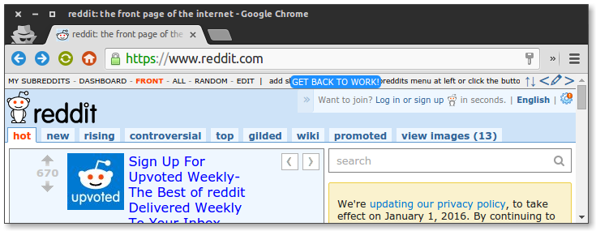
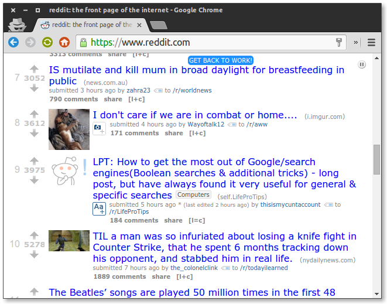

# back2work
Chrome extension to display a notification on selected websites to remind you to get back to work.

### Installation

Clone this repo and drag-drop it onto the extensions page on Google Chrome.

### Screenshots

